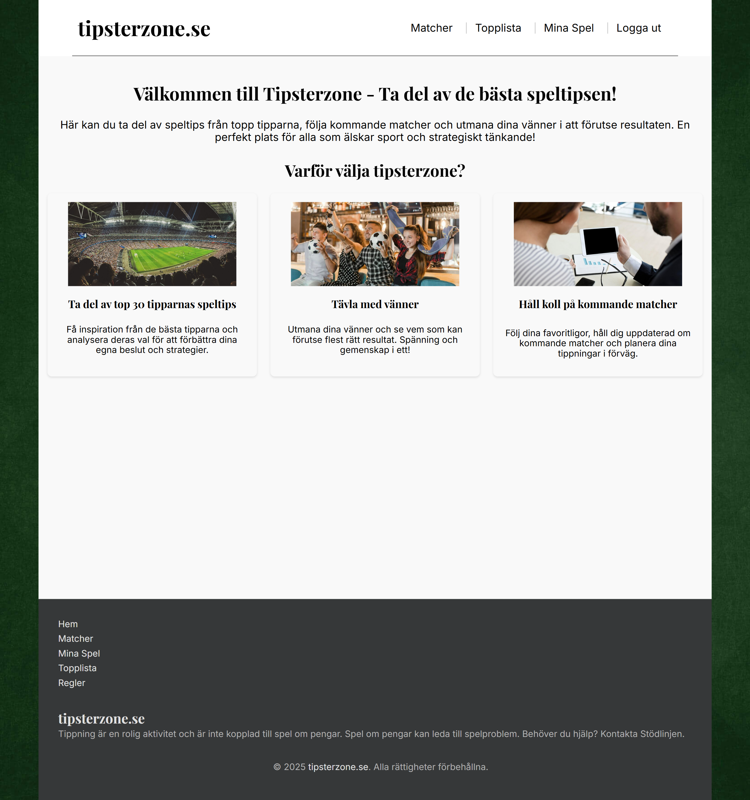
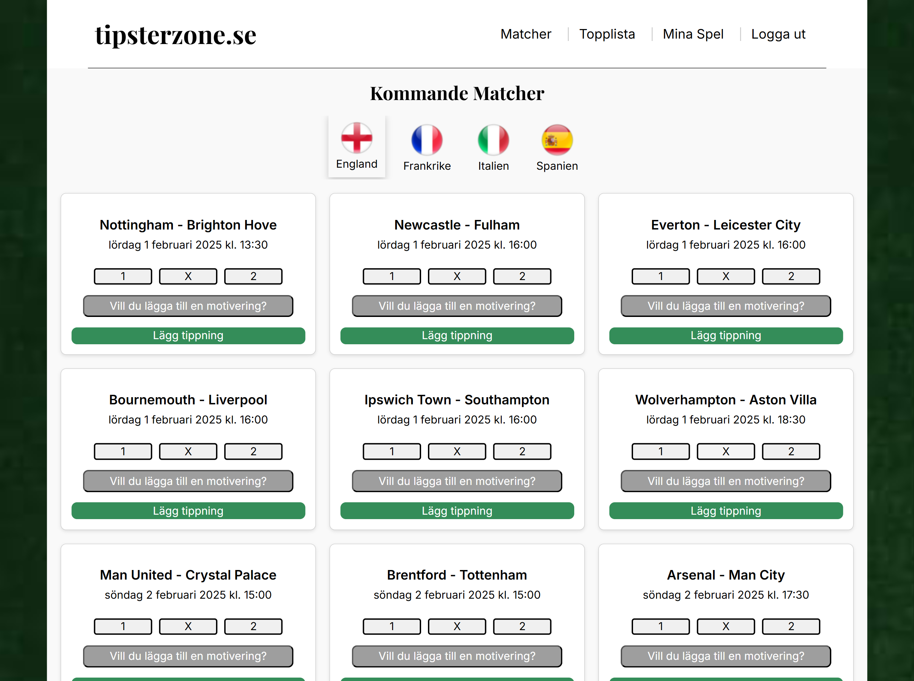
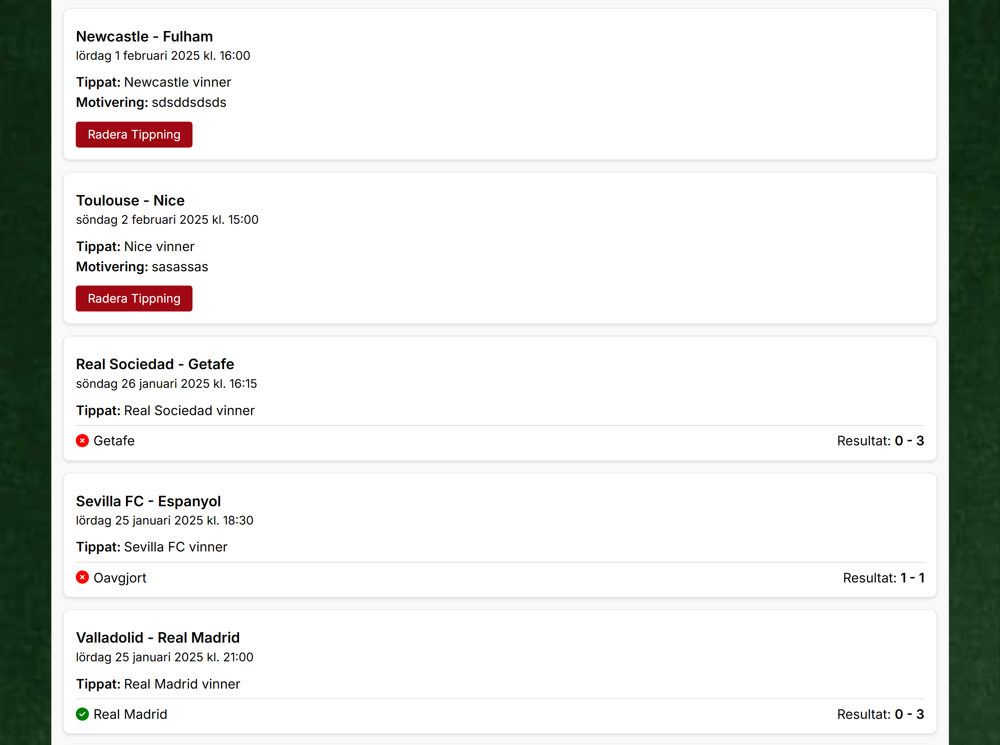
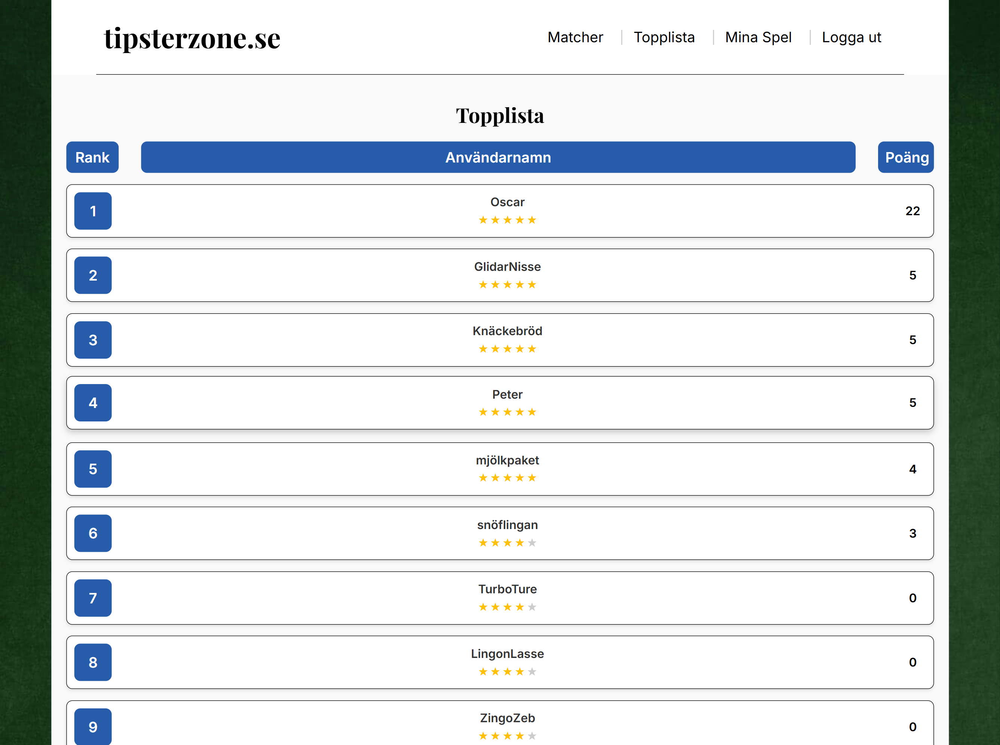
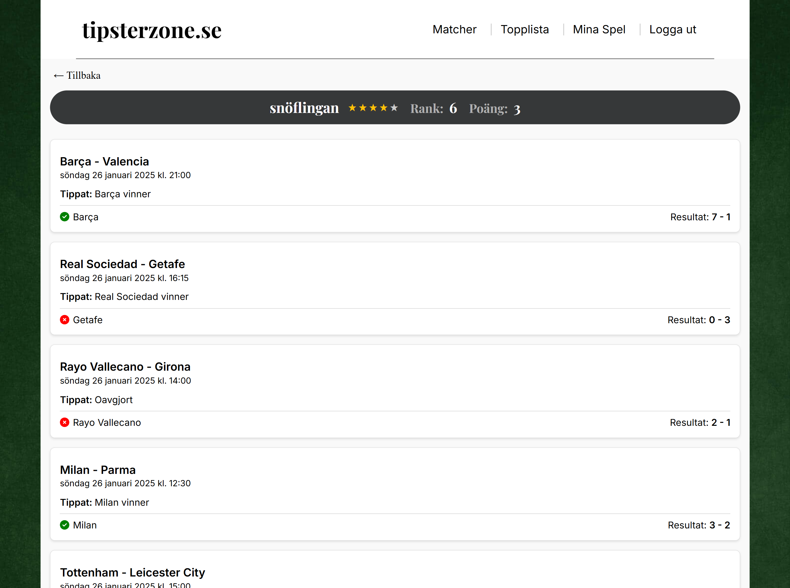

# TipsterZone - The Ultimate Betting Insights Platform

## Project Description

TipsterZone is the platform for football enthusiasts who want to predict match outcomes, compete with friends, and learn from top tipsters.

## How It Works

- Predict the outcome of matches (win/draw/loss).
- Earn points: +3 for a correct prediction, -1 for an incorrect one.
- Climb the leaderboard featuring the top 30 tipsters.
- Analyze expert predictions and improve your own betting strategies.

## Features

✅ Predict football match outcomes  
✅ Earn points and compete for the top rankings  
✅ View and analyze the top 30 tipsters' predictions  
✅ Stay updated on upcoming matches  
✅ Add reasoning to your predictions for better insights  
✅ Challenge friends and compare scores

## Tech Stack

### Frontend

- React
- Sass
- TypeScript
- Vite
- React router
- Axios
- ESlint
- dotenv

### Backend

- Node.js
- Cors
- Bcrypt
- Express
- Nodemon
- Axios
- dotenv
- Jest
- MongoDB
- Football-data API

## Screenshots

| **Title**                | **Screenshot Desktop**                                                     |
| ------------------------ | -------------------------------------------------------------------------- |
| Start page               |             |
| Matches                  |                            |
| Predictions              |                    |
| Leaderboard              |                    |
| Leaderboard user profile |  |

## Author

Oscar Kannerstedt 2025
Studying Frontend Developer at Medieinstitutet

- GitHub: https://github.com/oscarkannerstedt
- Linkedin: https://www.linkedin.com/in/oscarkannerstedt
